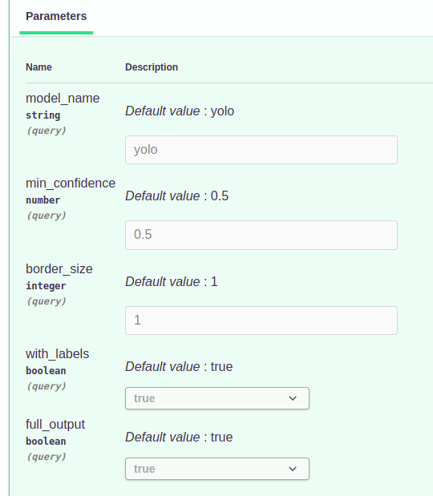

# photo-editing-webservice

Преставляет собой небольшой веб-сервис для обработки изображений. Обработка изображений производится
ассинхронно в фоновом режиме. При отправке запроса и всех необходимых параметров создаётся задача, которая
обрабатывается в порядке очереди. Затем результат можно получить обратившившись к специальному методу API. Он
возвращает статус выполнения задачи и, если обработка завершена, результат выполнения.

На данный момент реализовано 4 метода, которые могут быть использованы для обработки изображений:
1. Увеличение яркости изображения
2. Обрезание изображения
3. Склейка изображений в панораму
4. Обнаружение объектов на изображении с помощью нейронной сети

Помимо основных функций добавлены методы для работы с пользователями и авторизация.

Сервис можно запустить локально двумя способами: в docker контейнере и без контейнера.

Максимальный размер загружаемых файлов: 30 Мб

## Запуск сервиса локально без контейнера

Инструкция написана для машин работающих под OC linux.

Создаём виртуальное окружение

`python3 -m venv venv`

Активируем виртуальное окружение

`source venv/bin/activate` (linux)

Устанавливаем зависимости

`pip install -r requirements.txt`

Поднимаем экземпляр MongoDB (можно в виде docker контейнера). Затем создаём файл с переменными окружения (.env) и
заполняем его всеми необходимыми параметрами:

`SECRET_KEY` - секретный ключ приложения. Случайная строка. Используется для генерация jwt токена.

`SALT` - соль. Случайная строка. Используется для безопасного хранения паролей пользователей.

`MONGO_INITDB_DATABASE` - название базы данных.

`MONGO_INITDB_ROOT_USERNAME` - пользователь базы данных.

`MONGO_INITDB_ROOT_PASSWORD` - пароль пользователя базы данных.

`DB_HOST` - хост, на котором запущена база данных.

`DB_PORT` - порт, который прослушивает база данных.

`ADMIN_USERNAME` - имя пользователя администратора.

`ADMIN_PASSWORD` - пароль администратора.

`IBM_SSD_MODEL_URL` - URL на который нужно отправить запрос для распознавания объектов через модель IBM SSD
Подразумевается, что эта модель работает в отдельном докер контейнере. Нужно указать хост этого контейнера 
в локальной докер сети. См. .env.sample

Далее клонируем репозиторий darknet, в котором реализованы многие популярные архитектуры свёрточных нейронных
сетей.

Для этого переходим в папку lib:

`$ cd lib`

Клонируем репозиторий:

`lib$ git clone https://github.com/pjreddie/darknet`

Переходим в папку darknet и запускаем компиляцию библиотеки с помощью утилиты make:

`lib/darknet$ make`

Затем скачиваем веса обученной нейронной сети:

`lib/darknet$ wget https://pjreddie.com/media/files/yolov3.weights`

Переходим в корень проекта и запускаем сервис:

`$ bash run.sh` (linux)

Открываем swagger

`http://localhost:8000/docs`

Отправляем изображение на обработку. В ответе получаем job_id, по которому в дальнейшем получаем результат операции.

## Запуск сервиса локально в контейнере

Для запуска приложения в контейнере необходимо скачать веса модели и поместить их в корень! проекта:

`$ wget https://pjreddie.com/media/files/yolov3.weights`

Аналогично заполнить .env файл. И запустить контейнеры с помощью docker-compose:

`$ docker-compose up`

Открываем swagger

`http://localhost:8999/docs`

## Использование

Рассмотрим пример использования сервисов. На рисунке показаны все доступные методы.

Продемонстрируем работу сервиса на примере функции определения объектов на изображении. Перед выполнением
авторизуемся в сервисе с помощью сваггера.

На рисунке представлены передаваемые параметры:

`model_name` - название модели, которая будет использована для распознавания объектов. На данный момент доступно две
модели:
1. yolo - YOLO: Real-Time Object Detection (https://pjreddie.com/darknet/yolo/, https://github.com/pjreddie/darknet)
2. ssd - IBM Developer Model Asset Exchange: Object Detector (https://hub.docker.com/r/codait/max-object-detector)

`image` - изображение, на котором нужно определить объекты

`min_confidence` - минимальная вероятность распознаваемых объектов

`with_labels` - необходимо ли наносить метки распознанных объектов на результирующее изображение

`full_output` - возвращать полный результат (координаты, класс, вероятность) и краткий - только найденные объекты
и их количество

Сервер возвращает ответ в формате json. Для обработки изображения была создана задача и добавлена на фоновое
выполнение. Идентификатор созданной джобы job_id в дальнейшем можно будет использовать для получения результата

Для получения результатов обработки изображения отправляем запрос на эндпоинт '/image_processing/get_job_status'
передав job_id.

На рисунке показан результат в виде json. Результат содержит список найденных объектов. Каждый объект 
содержит координаты объекта на изображении, название класса и вероятность того, что объект распознан правильно.
Также в ответе содержится downloadable_url - url по которому можно получить готовое изображение.

На рисунке показано обработанное изображение, на котором выделены прямоугольниками найденные объекты

